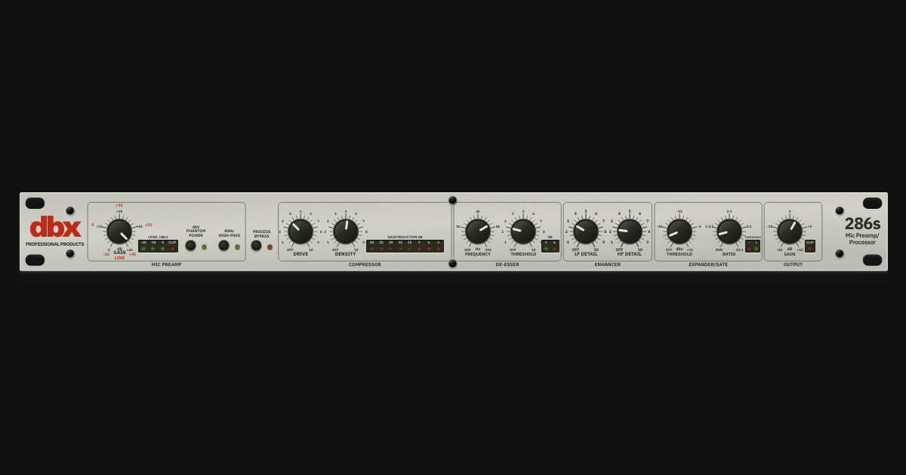

# DBX 286s



An interactive front-panel mock-up using [audiocn knobs](https://www.audiocn.dev/docs/components/knob). A header above the unit lets you copy presets, save defaults, reset controls, and choose a theme.

The ten knobs and the phantom power, high-pass filter, and process bypass switches use [nuqs](https://nuqs.dev) to store settings in the URL. Use Copy permalink to share or bookmark a complete preset. Reloading that link restores all its settings. Bypass dims the processor knobs, their labels and units, and the compressor, de-esser, and expander/gate meters. Section borders and titles stay unchanged. You can still adjust the knobs, and bypass keeps their values.

This demo does not process audio, access a microphone, or control hardware. Meter LEDs stay off. Starting values are examples, not official dbx presets.

## Run

```sh
pnpm install
pnpm dev
```

## Choose a theme

Use the icon button in the top-right corner to choose Light, Dark, or System. System follows your device's theme and is the default. Your browser saves your choice. The page background changes, but the rack panel keeps its colors. Theme choices do not change shared preset URLs.

## Use the controls

- Drag a knob up or down. Hold Shift to slow the drag.
- Tab moves between controls and skips the panel wrapper. Tab to a knob, then use arrow keys or the mouse wheel. Keyboard focus turns the knob's edge red and doubles its width.
- Use Home and End for the limits. Arrows, Alt+arrow, and the wheel move one position. Shift+arrow and Page Up/Down move ten positions.
- Hover or focus a knob to see its value. Each readout and value editor fits that control's widest value with 6px side padding. Text aligns to the right, so units stay in place as values change. Press Enter on the knob or double-click its value to type a number. Enter applies it; Escape cancels.
- Double-click a dial or Alt+click to restore its saved default, or its built-in default if none exists.
- On a narrow screen, scroll the unit sideways. Keyboard focus also scrolls controls into view.

All knobs have 41 fixed positions, including both limits. Positions are 7.5 degrees apart across the 300-degree sweep. Each knob keeps its printed marks and maps positions through its scale, so value steps can vary. Input gain uses 1.5 dB steps from 0 to +60 dB. Typed values snap to the nearest position. Shift and Alt cannot select values between positions.

Built-in defaults sit on fixed positions:

| Control            | Default   |
| ------------------ | --------- |
| Input gain         | +57.0 dB  |
| Drive              | 3.50      |
| Density            | 5.25      |
| De-esser frequency | 7.20 kHz  |
| De-esser threshold | 2.50      |
| LF detail          | 3.00      |
| HF detail          | 2.25      |
| Gate threshold     | -45.0 dBu |
| Gate ratio         | 1.30:1    |
| Output gain        | +2.0 dB   |

Readouts use one decimal place for input gain, output gain, and gate threshold. All other controls use two decimal places to show their smallest steps. OFF and MIN stay as text.

## Share settings

Click Copy permalink to copy a link that includes all ten knobs and all three switches, even values that match your defaults. The link restores the same preset in another browser or after you change your defaults. The button shows a green checkmark and "Copied" for two seconds without changing width.

Copy permalink also tries to replace the address bar URL with the full link, without adding a history entry. You can bookmark that URL. A failed URL update does not stop copying. If the clipboard is unavailable, a popup shows the link in a selected, read-only input for manual copying.

Control changes replace the current history entry. Missing or invalid values use your saved defaults, with built-in defaults as the fallback. Returning a control to its default removes its URL key. Use Copy permalink before sharing or bookmarking to include every value. Unrelated query parameters and the URL fragment stay intact.

| Control                | URL key       |
| ---------------------- | ------------- |
| Input gain             | `ingain`      |
| 48V phantom power      | `48v`         |
| 80 Hz high-pass filter | `hp`          |
| Process bypass         | `bypass`      |
| Drive                  | `drive`       |
| Density                | `density`     |
| De-esser frequency     | `deessfreq`   |
| De-esser threshold     | `deessthresh` |
| LF detail              | `lfdetail`    |
| HF detail              | `hfdetail`    |
| Gate threshold         | `gatethresh`  |
| Gate ratio             | `gateratio`   |
| Output gain            | `outgain`     |

Switches accept `on` or `off`. `bypass=on` bypasses processing. Invalid switch values use that switch's default. Knob values use numbers in the control's units. Frequency URLs use kHz with a `k` suffix, such as `deessfreq=6.4k`. Plain numbers mean Hz, so `800` and `0.8k` both mean 800 Hz. Invalid or out-of-range numbers use that control's default. Knobs display the nearest fixed position.

For example, `/?ingain=42&48v=on&hp=on&deessfreq=6.4k&outgain=0.5` loads those settings and uses defaults for the other controls.

`src/lib/query-state.ts` defines the parsers and `urlKeys` mappings. Each parser uses `.withDefault(storageValue ?? appDefault)`. The permalink serializer uses `clearOnDefault: false`.

## Save and reset defaults

Click Save as default to save all current controls in this browser's local storage. Saving takes effect at once without changing the controls or the URL. It replaces your previous defaults without a confirmation dialog. The app reads saved defaults before the first render, so the knobs start in the correct positions. Defaults stay in this browser; preset links contain their own values.

Click Reset to restore those defaults and clear the control parameters from the URL. Reset adds a history entry, so the browser's Back button restores the values from before the reset, including any recent knob edit waiting for a URL update. Double-click or Alt+click resets one knob to its own default.

Save as default and Reset are disabled when all controls match their defaults. If a save fails, the app keeps the previous defaults and shows an error below the header. Missing, unreadable, or invalid stored values fall back to the built-in defaults.

On narrow screens, Copy permalink and the theme control stay on the first row. Save as default and Reset move to the second row. The header stays outside the unit's horizontal scroll area.

## Component source

The preset header uses shadcn's `base-mira` Button, Separator, Popover, Input, and Alert components from `src/components/ui/`. The theme menu uses the same style. `PopoverContent` accepts an `anchor` prop so clipboard failures can open it beside the copy button. Global element styles stay in Tailwind's base layer so they do not override component borders, text sizes, or focus styles.

The app uses local copies of components from the `@audiocn` shadcn registry. `components.json` maps `@audiocn` to `https://www.audiocn.dev/r/{name}.json`.

- [`@audiocn/knob`](https://www.audiocn.dev/r/knob.json) supplies `src/components/ui/knob.tsx`.
- [`@audiocn/use-audio-config`](https://www.audiocn.dev/r/use-audio-config.json) and [`@audiocn/use-audio-context`](https://www.audiocn.dev/r/use-audio-context.json) supply the hooks in `src/hooks/`.
- [`@audiocn/core`](https://www.audiocn.dev/r/core.json) supplies the four supporting files in `src/lib/audio/`.

Inspect the registry sources without changing the local files:

```sh
pnpm exec shadcn view @audiocn/knob @audiocn/use-audio-config @audiocn/use-audio-context @audiocn/core
```

Do not overwrite the local files without checking the app's changes below.

The app formats the copied files with Oxfmt. The local `Knob` adds an optional `taper` prop for custom value-to-angle mapping. Reset events also fire when the dial position stays the same, so a knob can restore an exact saved value between positions. `PanelKnob` in `src/App.tsx` composes audiocn's `KnobDial`, `KnobLabel`, and `KnobValue` with a custom SVG cap and `UnitScale`. `PanelKnob` uses positions 1 through 41 internally and maps them to control values for state, typed input, readouts, and accessible slider values. Click sounds remain off.

`src/lib/controls.ts` defines the starting values. `src/lib/graduations.ts` records the printed values from the close-up photos in `unit/`. All knobs use a 300-degree sweep. The frequency, gate, ratio, and output controls use linear interpolation between printed marks, so the pointer aligns with each label.

OFF uses -60 for the gate. The ratio control uses 1 as an internal MIN marker, not a claim that the hardware has a 1:1 ratio. Only the minimum position shows MIN; higher positions show numeric ratios. You can type OFF or MIN where the panel uses those labels. These are visual approximations, not measured circuit curves. The [dbx product page](https://dbxpro.com/en-US/products/286s) lists the hardware specs.

## Refresh the preview image

Social previews and this README use `public/og-image.png`, a 1200 by 630 screenshot of the unit in dark mode with the starting settings. After a panel change, update it with:

```sh
pnpm exec playwright install chromium
pnpm screenshot:og
```

The command starts a local server and closes it after the capture. `index.html` uses the public image URL at `https://dbx-286s.francoisbest.com/og-image.png`.

## Check

```sh
pnpm exec playwright install chromium
pnpm test
pnpm check
pnpm build
```

Browser tests cover theme choices, saved themes, system theme changes, the panel layout, keyboard and drag input, typed values, reset, switches, URL settings and reloads, saved defaults on the first render, complete permalinks, clipboard and storage failures, Reset with Back, browser navigation, invalid query values, narrow-screen header layout and panel access, pointer alignment with printed marks, meter labels, and clearance between labels, LEDs, meters, and section borders.
